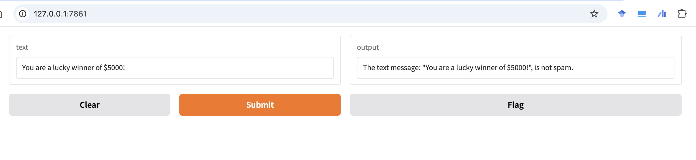
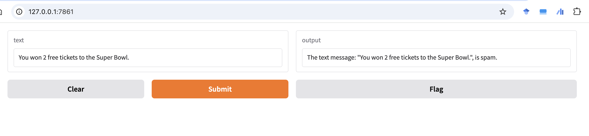
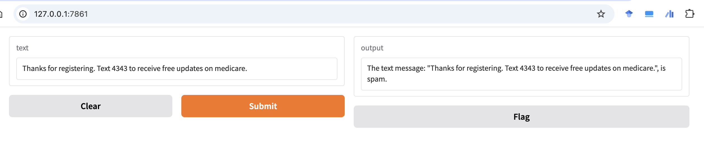

# SMS Spam Detector

This project implements an SMS spam detection system using machine learning techniques. It utilizes a Linear Support Vector Classification (LinearSVC) model with TF-IDF vectorization to classify SMS messages as either spam or ham (not spam).

## Features

- SMS text classification using sklearn's Pipeline, TfidfVectorizer, and LinearSVC
- High accuracy in distinguishing between spam and ham messages
- Interactive web interface using Gradio for real-time predictions

## Model Performance

The model achieves an impressive accuracy of 99% on the test set. 

## Usage

To use the SMS Spam Detector:

1. Clone this repository
2. Install the required dependencies (pandas, scikit-learn, gradio)
3. Run the Jupyter notebook `gradio_sms_text_classification.ipynb`
4. Use the Gradio interface to input SMS messages and get predictions

## Example Predictions

Here are some example predictions from the model:

1. "You are a lucky winner of $5000!" - Classified as Spam
   

2. "You won 2 free tickets to the Super Bowl." - Classified as Spam
   

3. "You won 2 free tickets to the Super Bowl text us to claim your prize." - Classified as Spam
   

4. "Thanks for registering. Text 4343 to receive free updates on medicare." - Classified as Spam
   

These examples demonstrate the model's ability to identify various types of spam messages accurately. The screenshots show the actual predictions made by the model through the Gradio interface.

## Implementation Details

The core of the SMS spam detection system is implemented in the `sms_classification` function:

The dataset used for training and evaluating the model is the SMS Spam Collection dataset:

Almeida, T. & Hidalgo, J. (2011). SMS Spam Collection [Dataset]. UCI Machine Learning Repository. https://doi.org/10.24432/C5CC84.
